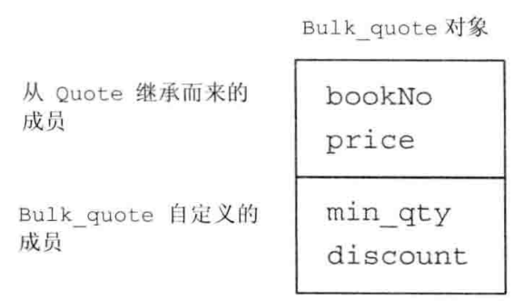

## Object-orinted Program
&ensp;&ensp;&ensp;&ensp;面向对象程序涉及基于三个基本概念: 数据抽象、继承和动态绑定。在很多程序中都存在着一些相互关联但是有细微差别的概念。例如:书店中不同书籍的定价策略可能不同：有的书籍按原价销售，有的则按打折销售。

### OOP：概述
&ensp;&ensp;&ensp;&ensp;**面向对象程序设计**的核心思想是数据抽象、继承和动态绑定。*数据抽象*，将类的接口与实现分离；*继承*，定义相似的类型并对其相似关系建模；*动态绑定*，在一定程度上忽略相似类型区别，而以统一方式使用它们对象。

##### 继承
&ensp;&ensp;&ensp;&ensp;在层次关系的根部有一个**基类**，其他类直接或间接从基类继承而来，这些继承得到的类称为**派生类**。基类负责定义在层次关系中所有类共同拥有的成员，每个派生类定义各自特有成员。<br>
&ensp;&ensp;&ensp;&ensp;不同定价策略建模，我们定义一个名为Quote的类，并作为层次关系中的基类。Quote对象表示按原价销售的书籍。Quote派生出另一个名为Bulk_quote的类，表示打折销售书籍。
```C++
class Quote{
    public:
        std::string isbn() const;
        virtual double net_price(std::size_t n) const;
};
```
&ensp;&ensp;&ensp;&ensp;对于某些函数，基类希望它派生类各自定义适合自身的版本，此时基类就将这些函数声明成**虚函数(virtual function)**。<br>
&ensp;&ensp;派生类必须通过使用*类派生列表*明确指出它是从哪个基类继承而来，类派生列表的形式：首先一个冒号，后面紧跟逗号分隔的基类列表，其中每个基类前面可以有访问说明符:
```C++
class Bulk_quote: public Quote{
    public:
        double net_price(std::size_t ) const override;
}
```
&ensp;&ensp;&ensp;&ensp;因为Bulk_quote在它的派生列表中使用了public关键字，我们完全可以把Bulk_quote的对象当成Quote的对象来使用。<br>
&ensp;&ensp;&ensp;&ensp;派生类必须在其内部对所有重新定义的虚函数进行声明。派生类可以在这样的函数之前加virtual关键字，但并不是非得这么做。C++11新标准允许派生类显式注明他将使用哪个成员函数改写基类的虚函数，具体措施是在该函数的形参列表之后增加一个override关键字。

##### 动态绑定 
&ensp;&ensp;&ensp;&ensp;通过使用**动态绑定(dynamic binding)**, 我们能用同一段代码分别处理Quate和Bulk_quote对象。举个例子:

```c++
double print_total(ostream &os, const Quate &item, size_t n)
{
    double ret = item.net_price(n);
    return ret;
}

print_total(std::cout, basic, 20);
print_total(std::cout, bulk, 20);
```
&ensp;&ensp;&ensp;&ensp;第一个函数调用将Quate对象传入print_total, 因此执行的是Quate的版本。第二个函数调用，实参是Bulk_quote，因此执行的是Bulk_quote版本。在上述过程中函数的运行版本由实参决定，在运行时选择函数的版本，所以动态绑定有时又被称为**运行时绑定**

### 定义基类和派生类
#### 定义基类
完成Quate类的定义:
```C++
class Quate{
    public:
        Quate() = default;
        Quate(std::string &_isbn, double _price = 0.0):price_(_price), isbn_(_isbn) {}
        std::string isbn(void) const {return isbn_;}
        virtual double net_price(std::size_t n) const
        {
            return price_ * n;
        }

        virtual ~Quate() = default; //对析构函数进行动态绑定

    protected:
        double price_;

    private:
        std::string isbn_;
};

```
作为继承关系中根节点的类通常会定义一个虚析构函数。
- 基类通常都应该定义一个虚析构函数，即使该函数不执行任何实际操作也是如此

##### 成员函数与继承
&ensp;&ensp;&ensp;&ensp;派生类可以继承其基类的成员，然而当遇到如**net_price**(虚函数)这样与类型相关的操作时，派生类必须对其重新定义。派生类需要对这些操作提供自己的重新定义 **覆盖(override)** 从基类继承而来的旧定义。

&ensp;&ensp;&ensp;&ensp;在C++语言中，基类必须将它的两种成员函数区分开来: 一种是**虚函数** 基类希望其派生类进行覆盖的函数；另一种是派生类直接继承而不改变的函数。当我们是用指针或引用调用虚函数时，该调用动态绑定：根据引用或指针所绑定的对象类型不同，该调用可能执行基类的版本，也可能执行某个派生类的版本。

&ensp;&ensp;&ensp;&ensp;基类通过在其成员函数的声明语句之前加上关键字virtual使得该函数执行动态绑定。任何构造函数之外的非静态函数都可以是虚函数。关键字virtual只能出现在类的声明中，而不能用于类外部的函数定义。如果基类把一个函数定义声明成虚函数，则该函数在派生类中也是隐式的虚函数。

&ensp;&ensp;&ensp;&ensp;成员函数没被声明成虚函数，则其解析过程发生在编译时而非运行时。

##### 访问控制与继承
&ensp;&ensp;&ensp;&ensp;派生类可以继承定义在基类中的成员，但是派生类成员函数不一定有权访问从基类继承而来的成员。派生类可以访问共有成员，而不能访问私有成员。有时基类希望它的派生类有权访问该成员，但同时禁止其他用户访问。我们用 **受保护的(protected)** 访问运算符说明这样的成员。

#### 定义派生类
&ensp;&ensp;&ensp;&ensp;派生类必须通过使用 **派生类列表(class derivation list)** 明确指出它是从哪个基类继承而来的。类派生列表的形式是： 首先是一个冒号，后面紧跟逗号分隔的基类列表，其中每个基类前面可以有以下三种访问说明符中的一个：public、protected 或者private。
&ensp;&ensp;&ensp;&ensp;派生类必须将其继承而来的成员函数中需要覆盖的那些重新声明，因此，我们的Bulk_quate类必须包含一个net_price成员:
```C++
class Bulk_Quate:public Quate
{
    public:
       Bulk_Quate() = default;
       Bulk_Quate(std::string &_isbn, double _price = 0.0, double _discount = 1):Quate(_isbn,_price), discount_(_discount) {}
       double net_price(std::size_t n) const override
       {
            return price_ * n * discount_;
       }
    private:
        double discount_;
};
```
&ensp;&ensp;&ensp;&ensp;如果一个派生类是public的，则基类的共有成员也是派生类接口的组成部分。此外，我们能将共有派生类的对象绑定到基类的引用或指针上。因为我们在派生类列表中使用了public，所以Bulk_quote的接口隐式地包含isbn函数。

大多数类都只继承自一个类，这种形式地继承称作单继承。

##### 派生类中的虚函数
&ensp;&ensp;&ensp;&ensp;派生类经常(但不总是)覆盖它继承的虚函数。如果派生类没有覆盖其基类中的某个虚函数，则该虚函数的行为类似于其他的普通成员，派生类会直接继承其在基类中的版本。派生类可以在它覆盖的函数前使用virtual关键字，但不是非得这么做。

&ensp;&ensp;&ensp;&ensp;C++11新标准允许派生类显示地注明它使用某个成员函数覆盖它继承的虚函数。具体做法是在形参列表后面、或者在const成员函数的const关键字后面、或者在引用成员函数的引用限定符后面添加一个关键字override。

##### 派生类对象及派生类向基类的类型转换
&ensp;&ensp;&ensp;&ensp;一个派生类对象包含多个组成部分：一个含有派生类自己定义(非静态)的成员的子对象，以及一个与该派生类继承的基类对应的子对象，如果有多个基类，那么这样的子对象也有多个。因此，一个Bulk_quote对象将包含四个数据元素：它从Quate继承而来的bookNO和price数据成员，以及Bulk_quote自己定义的min_qty和discount成员。
&ensp;&ensp;&ensp;&ensp;C++标准并没有明确规定派生类的对象在内存中如何分布，但是我们可以认为Bulk_quote的对象包含如下图所示两部分。



&ensp;&ensp;&ensp;&ensp;因为在派生类对象中含有与其基类对应的组成部分，所以我们能把派生类的对象当成基类对象来使用，而且我们也能将基类的指针或引用绑定到派生类对象中的基类部分上。
```C++
Quate item;             // 基类对象
Bulk_quote bulk;        // 派生类对象
Quate *p= &item;        // p指向Quate 对象
p = &bulk;              // p指向bulk的Quate部分
Quate &r = bulk;        // r绑定到bulk的Quate部分
```
&ensp;&ensp;&ensp;&ensp;这种转换通常称为派生类到基类的(derived-to-base)类型转换。和其他类型转换一样，编译器会隐式地执行派生类到基类地转换。这种隐式特性意味着我们可以把派生类对象或派生对象的引用用在需要基类引用的地方；同样的，我们也可以把派生类对象的指针用在需要基类指针的地方。

##### 派生类构造函数
&ensp;&ensp;&ensp;&ensp;尽管在派生类对象中含有从基类继承而来的成员，但是派生类并不能直接初始化这些成员。派生类也必须使用基类的构造函数来初始化它的基类部分。<br>
&ensp;&ensp;&ensp;&ensp;派生类对象的基类部分与派生类对象自己的数据成员都是在构造函数的初始化阶段执行初始化操作。例如接受四个参数的Bulk_quote构造函数:
```C++
class Bulk_Quate:public Quate
{
    public:
       Bulk_Quate() = default;
       Bulk_Quate(std::string &_isbn, double _price = 0.0, double _discount = 1):Quate(_isbn,_price), discount_(_discount) {}
      
    private:
        double discount_;
};
```
**Bulk_Quate** 函数将前两个参数传递给Quate的构造函数，由Quate的构造函数负责初始化Bulk_Quate的基类部分。当Quate构造函数结束后，我们构建的对象基类部分也就完成初始化了。接下来初始化由派生类直接定义的discount成员。最后运行Bulk_Quate构造函数体。<br>
除非我们特别指出，否则派生类对象的基类部分会像数据成员一样执行默认初始化。如果想使用其他的基类构造函数，我们需要以类名加圆括号内的实参列表形式为构造函数提供初始值。这些实参将帮助编译器决定到底应该选用哪个构造函数来初始化派生类对象的基类部分。

##### 派生类使用基类的成员
派生类可以访问基类的公有成员和受保护成员:
```C++
 double net_price(std::size_t n) const override
{
            return price_ * n * discount_;
}
```
 - 派生类对象不能直接初始化基类的成员

 ##### 继承与静态成员
 如果基类定义了一个静态成员，则整个继承体系中只存在该成员的唯一定义。
 ```C++
 class Base{
    public:
        static void statmem();
 };
 class Derived : public Base {
    void f(const Derived&);
 };
 ```
 静态成员遵循通用访问控制规则，基类中成员是private的，则派生类无权访问。静态成员可访问的，我们既能通过基类使用也能通过派生类使用它:
 ```C++
 void Derived::f(const Derived &derived_obj)
 {
    Base::statmem();        //正确，base定义了statmem()
    Derived::statmem();     //正确，Derived定义了statmem()
    derived_obj.statmem();  //通过Derived对象访问
    statmem();              //通过this对象访问
 }
 ```
 ##### 派生类的声明
 派生类的声明与其他类差别不大，声明中包含类名但是不包含它的派生类列表:
 ```C++
 class Bulk_quote:public Quote;  //错误，派生类列表不能出现在这里
 class Bulk_quote;               //正确，声明派生类的正确方式
 ```

 ##### 被用作基类的类
 我们想将某个类用作基类，则该类必须已经定义而非仅仅声明:
 ```C++
 class Quate;       //声明但未定义
 class Bulk_quote:public Quote {};  //错误: Quote必须被定义
 ```
 这个规定还有一层隐含的意思，一个类不能派生它本身。<br>
 一个类是基类，同时它也可以是一个派生类：
 ```C++
 class Base{};
 class D1:public Base {};
 class D2:public D1{};
 ```
 Base是D1的**直接基类(direct base)**, 是D2的**间接基类(indirect base)**。最终的派生类将包含它的直接基类的子对象以及每个间接基类的子对象。

 ##### 防止继承的发生

 有时我们会定义这样一种类，我们不希望其他类继承它。C++11新标准定义了一种防止继承发生的方法，在名后跟一个关键字final:
 ```C++
 class NoDerived final{};
 class Base {};
 class Last final: Base{};  //last不能作为基类
 class Bad: NoDerived {};   //错误，NoDerived是final的
 class Bad2: Last {};       //错误，Last是final的
 ```
#### 类型转换与继承
存在继承关系的类：我们可以将基类的指针或引用绑定到派生类对象上。例如，我们可以将Quate&指向一个Bulk_quote对象，也可以把一个Bulk_quote的对象地址赋给一个Quote*。当使用基类的引用（或指针）时，实际上我们并不清楚该引用（或指针）所绑定对象的真实类型。该对象可能是基类的对象，也可能是派生类的对象。

##### 静态类型与动态类型
当我们使用存在继承关系的类型时，必须将一个变量或其他表达式的**静态类型(static type)**与该表达式表示对象的**动态类型(dynamic type)**区分开来。表达式的静态类型在编译时总是已知的，它是变量声明时的类型或表达式生成的类型：动态类型则是变量或表达式表示的内存中对象的类型。动态类型直到运行时才可知。
```C++
double ret = item.net_price(n);
```
我们知道item的静态类型是Quote&, 它的动态类型依赖于item绑定的实参，动态类型直到运行时调用该函数时才会知道。如果我们传递一个Bulk_quote对象给print_total，则item的静态类型将与它的动态类型不一致。如前所述，item的静态类型是Quote&,而在此例中它的动态类型则是Bulk_quote。

##### 不存在从基类向派生类的隐式类型转换
之所以存在派生类向基类的类型转换是因为每个派生类对象包含一个基类部分，而基类的引用或指针可以绑定到该基类部分上。一个基类的对象既可以独立形式存在，也可以作为派生类对象一部分存在。如果基类对象不是派生类对象一部分，则它只有基类定义的成员，而不含有派生类定义的成员。不存在从基类向派生类的自动类型转换:
```C++
Quote base;
Bulk_quote* bulkp= &base;
Bulk_quote& bulkRef = base;
```
还有一种情况显得有点特别，即使一个基类指针或引用绑定在一个派生类对象上，我们也不能执行从基类向派生类的转换:
```C++
Bulk_quote bulk;
Quote *basep = &bulk;           //正确： 动态类型是Bulk_quote
Quote_quote *bulkp = basep;     //错误：不能将基类转换成派生类
```
编译器在编译时无法确定某个特定的转换在运行时是否安全，这是因为编译器只能通过检查指针或引用的静态类型来推断该转换是否合法。如果在基类中还有一个或多个虚函数，我们可以使用dynamic_cast请求一个类型转换，该转换的安全检查将在运行时执行。同样，如果我们已知某个类型向派生类的转换是安全的，则我们可以使用static_cast来强制覆盖掉编译器的检查工作。

##### 在对象之间不存在类型转换
派生类向基类的自动类型转换只对指针或引用类型有效，在派生类类型和基类类型之间不存在这样的转换。很多时候，我们确实希望将派生类对象转换成它的基类类型，但是这种转换的实际发生过程往往与我们期望有所差别。


