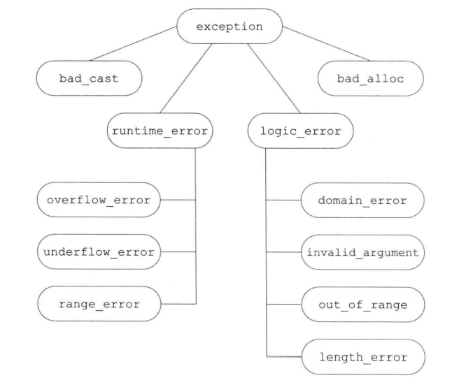

## Tools for Large Programs
本章价绍三种C++语言特性：异常处理、命名空间和多重继承

### 异常处理
异常处理（**exception handling**)机制允许程序中独立开发的部分能够在运行时就出现的问题进行通信并作出相应的处理。异常使得我们能够将问题的检测与解决过程分离开来。程序的一部分负责检测问题的出现，然后解决该问题的任务传递给程序的另一部分。

#### 抛出异常
在C++语言中，我们抛出(throwing)一条表达式引发(raised)一个异常。被抛出的表达式的类型以及当前的调用链共同决定了哪段处理代码(handler)将被用来处理该异常。<br>
当执行一个throw时，跟在throw后面的语句将不再执行。相反，程序的控制权从throw转移到了与之匹配的catch模块。该catch可能是同一个函数中的局部catch，也可能位于直接或间接调用了发生异常的函数的另一个函数中。控制权从一处转移到另一处，这有两个含义:
- 沿着调用链的函数可能会提早退出
- 一旦程序开始执行异常处理代码，则沿着调用链创建的对象将被销毁

跟在throw后面的语句将不再被执行，所以throw语句的用法有点类似return。

##### 栈展开
当抛出一个异常后，程序暂停当前函数的执行过程并立即开始寻找与异常匹配的catch子句。当throw出现在**try语句块**(**try block**)内时，检查与该try块关联的catch子句。找到匹配的catch，就使用该catch处理异常。如果没找到匹配的catch，且该try语句嵌套在其他try块中，则继续检查与外层try匹配的catch子句。如果还是找不到匹配的catch，则退出当前的函数，在调用当前函数的外层函数中继续寻找。<br>
如果对抛出异常的函数的调用语句位于try语句块内，则检查与该try块关联的catch子句。如果找到了匹配的catch，就使用该catch处理异常。否则，如果该try语句嵌套在其他try块中，继续检查与外层try匹配的catch子句。如果仍然没找到匹配的catch，就退出当前这个主调函数，继续在调用了刚刚退出的这个函数的其他函数中寻找，以此类推。<br>
上诉过程称为**栈展开**(**stack unwinding**)过程。栈展开过程沿着嵌套函数的调用链不断查找，直到找到了与异常匹配的catch子句为止；或者也有可能一直没找到匹配的catch,则退出主函数后查找过程终止。<br>
假设找到了一个匹配的catch子句，则程序进入该子句并执行其中的代码。当执行完这个catch子句后，找到与try块关联的最后一个catch子句之后的点，并从这里继续执行。<br>
如果没找到匹配的catch子句，程序将退出。因为异常通常被认为是妨碍程序正常执行的事件。当找不到匹配的catch时，程序将调用标准库函数**terminate**， 顾名思义，terminate负责终止程序的执行过程。

- 一个异常如果没有被捕获，则它将终止当前的程序

##### 栈展开过程中对象被自动销毁
在栈展开过程中，位于调用链上的语句块可能会提前退出。通常情况下，程序在这些块中创建了一些局部对象。我们已经知道，块退出后它的局部对象也将随之销毁，这条规则对于栈展开过程同样适用。如果某个局部对象的类型是类类型，则该对象的析构函数将被自动调用。<br>
异常发生在构造函数中，则当前的对象可能只构造了一部分。有的成员已经初始化了，而另外一些成员在异常发生前也许还没有初始化。如果异常发生前已经构造了一部分元素，则我们应该确保这部分元素被正确地销毁。

##### 析构函数与异常
析构函数不应该抛出不能被自身处理的异常。如果需要析构函数执行某个可能抛出异常的操作，则该操作应该被放置在一个try语句块中，并且析构函数内部得到处理。<br>
在实际的编程中，因为析构函数仅仅是释放资源，所以它不太可能抛出异常。所有标准库类型都能确保它们的析构函数不会引发异常。

- 一旦在栈展开的过程中析构函数抛出了异常，并且析构函数自身没能捕获到该异常，则程序将被终止。

##### 异常对象
**异常对象** (exception object)是一种特殊的对象，编译器是用异常抛出表达式来对异常对象进行拷贝初始化。因此, throw语句中的表达式必须拥有完全类型。

#### 捕获异常
**catch**子句中的异常声明看起来像是只包含一个形参的函数形参列表。声明的类型决定了处理代码所能捕获的异常类型。这个类型必须是完全类型，它可以是左值引用，但不能右值引用。

##### 查找匹配的处理代码
在搜寻catch语句的过程中，我们最终找到catch未必是异常的最佳匹配。相反，挑选出来的应该是第一个与异常匹配的catch语句。因此，越是专门的catch越应该置于整个catch列表的前端。<br>
catch 语句是按照其出现的顺序逐一进行匹配，所以当程序使用具有继承关系的多个异常时必须对catch语句的顺序进行组织和管理，使得派生类异常的处理代码出现在基类处理代码之前。<br>
与实参和形参的匹配规则相比，异常和catch异常声明的匹配规则受到更多限制。此时，绝大多数类型转换都不被允许，除了一些及细小的差别之外，要求异常的类型和catch声明的类型是精确匹配的:
- 允许非常量向常量的类型转换
- 允许派生类向基类的转换
- 数组被转换成指向数组类型的指针，函数被转换成指向该函数类型的指针。

除此之外，包括标准算术类型转换和类类型转换在内，其他所有转换规则都不能匹配catch的过程中使用。

##### 重新抛出
有时，一个单独的catch语句不能完整处理某个异常。在执行了某些校正操作后，当前的catch可能会决定由调用链更上一层的函数接着处理异常。一条catch语句通过重新抛出(rethrowing),将异常传递给另外一个catch语句。这里的重新抛出仍然是一条throw语句，只不过不包含任何表达式:
```C++
throw;
```
空的throw语句只能出现在catch语句或catch语句直接或间接调用的函数之内。如果在处理代码之外的区域遇到了空throw语句，编译器将调用terminate。<br>
一个重新抛出语句并不指定新的表达式，而是将当前的异常对象沿着调用链向上传递。<br>
很多时候，catch语句会改变其参数的内容。如果在改变了参数的内容后catch语句重新抛出异常，则只有当catch异常声明是引用类型时我们对参数所作的改变才会被保留并继续传播:
```C++
catch (my_error &eObj)                      // 引用类型
{
    eObj.status = errCodes::servereErr;     // 修改了异常对象 
    throw;                                  // 异常对象的status成员是severeErr
}
catch (other_error eObj)                    // 非引用类型
{
    eObj.status = errCodes::badErr;
    throw;   // 异常对象的status 成员没改变
}
```

##### 捕获所有异常的处理代码
为了一次性捕获所有异常，我们使用省略号为异常声明，这样的处理代码称为捕获所有异常(catch-all)的处理代码，形如catch(...)。一条捕获所有异常的语句可以与任意类型的异常匹配。<br>
catch(...)通常与重新抛出语句一起使用，其中catch执行当前局部能完成的工作，随后重新抛出异常:
```C++
void main(int argc, char *argv[])
{
    try{
        // 这里的操作将引发并抛出一个异常
    }catch (...) {
        // 处理异常的某些特殊操作
        throw;
    }
}
```
catch(...)既能单独出现，也能与其他几个catch语句一起出现。

##### 函数try语句块与构造函数
通常情况下，程序执行的任何时刻都可能发生异常，特别是异常可能发生在处理构造函数初始值的过程中。构造函数在进入其函数体之前首先执行初始值列表。因为在初始值列表抛出异常时构造函数体内的try语句块还未生效，所以构造函数体内的catch语句无法处理构造函数初始值列表抛出的异常。<br>
要想处理构造函数初始值抛出的异常，我们必须将构造函数写成**函数try语句块**的形式。函数try语句块使得一组catch语句既能处理构造函数体，也能处理构造函数的初始化过程。举个例子，我们可以把Blob的构造函数置于一个函数try语句块中:
```C++
template <tepename T>
Blob<T>::Blob(std::initializer_list<T> il) try : data(std::make_shared<std::vector<T>>)
{
    //空函数体
} 
catch(const std::bad_alloc &e) {
    handle_out_of_memory(e);
}
```
与这个try关联的catch既能处理构造函数体抛出的异常，也能处理成员初始化列表抛出的异常。<br>
还有一种情况值得注意，在初始化构造函数的参数时也有可能发生异常，这样的异常不属于函数try语句块的一部分。和其他函数调用一样，如果参数初始化过程中发生了异常，则该异常属于调用表达式的一部分，并将再调用者所在的上下文中处理。

#### noexcept异常说明
C++11标准中，我们可以通过**noexcept说明**(noexcept specification)指定某个函数不会抛出异常。其形式是关键字noexcept紧跟在函数的参数列表后面，用以标识该函数不会抛出异常。
```C++
void recoup(int) noexcept;          // 不会抛出异常
void alloc(int);                    // 可能抛出异常
```
这两条声明语句指出recoup将不会抛出任何异常，而alloc可能会抛出异常。<br>
对于一个函数来说，noexcept说明要么出现在该函数的所有声明语句和定义语句中，要么一次也不出现。我们也可以在函数指针的声明和定义中指定noexcept。在typedef或类型别名中则不能出现noexcept。在成员函数中，noexcept说明符需要跟在const及引用限定符之后，而在final、override或虚函数=0之前。

##### 违反异常说明
需要清楚的一个事实是编译器并不会在编译时检查noexcept说明。实际上，如果一个函数在说明了noexcept的同时又含有throw语句或者调用了可能抛出异常的其他函数，编译器将顺利编译通过，并不会因为这种违法异常说明的情况而报错。<br>
因此可能出现这样一种情况: 尽管函数声明了它不会抛出异常，但实际上还是抛出了。一旦一个noexcept函数抛出异常，程序就会调用terminate以确保遵守不在运行时抛出异常的承诺。上述过程对是否执行栈展开未作约定，因此noexcept可以用在两种情况下：
- 我们确认函数不会抛出异常
- 我们根本不知道该如何处理异常

noexcep说明符接受一个可选的实参，该实参必须能转换为bool类型：如果实参是true,则函数不会抛出异常；如果实参是false,函数可能会抛出异常:
```C++
void recoup(int) noexcept(true);    // 不会抛出异常
void alloc(int)  noexcept(false);   // 可能抛出异常
```

##### noexcept运算符
noexcept说明符的实参常常与**noexcept运算符**(noexcept operator)混合使用。noexcept运算符是一个一元运算符，它的返回值是一个bool类型的右值常量表达式，用于表示给定的表达式是否会抛出异常。和sizeof类似，noexcept也不会求其运算对象的值。<br>
我们声明recoup时使用了noexcept说明符，所以下面的表达式的返回为true:
```C++
noexcept(recoup(i))
```
我们可以使用noexcept运算符得到如下的异常说明:
```C++
void f() noexcept(noexcept(g())); // f和g的异常说明一样
```
如果函数g承诺了不会抛出异常,那么函数f也不会抛出异常;如果g没有异常说明符，或者g虽然有异常说明符但是允许抛出异常，则f也可能抛出异常。

##### 异常说明与指针、虚函数和拷贝控制
尽管noexcept说明符不属于函数类型的一部分，但是函数的异常说明仍然会影响函数的使用。<br>
函数指针及该指针所指的函数必须具有一致的异常说明。如果我们为某个指针做了不抛出异常的声明，则该指针将只能指向不抛出异常的函数。相反，如果我们显式或隐式地说明了指针可能抛出异常，则该指针可以指向任何函数，即使是承诺了不抛出异常地函数也可以:
```C++
// recoup 和pf1都承诺不会抛出异常
void (*pf1)(int) noexcept=recoup; 
// recoup不会抛出异常，pf2可能抛出异常，二者之间互不干扰
void (*pf2)(int) = recoup;

pf1 = alloc;    // 错误: alloc可能抛出异常，但是pf1明说了它不会抛出异常
pf2 = alloc;    // 正确：pf2和alloc都可能抛出异常
```
如果一个虚函数承诺了它不会抛出异常，则后续派生出来的虚函数也必须做同样的承诺；相反，如果基类的虚函数允许抛出异常，则派生类的对应函数既可以允许抛出异常，也可以不允许抛出异常:
```C++
class Base{
    public:
        virtual double f1(double) noexcept; //不会抛出异常
        virtual int f2() noexcept(false);   //可能抛出异常
        virtual void f3();                  //可能抛出异常  
};
class Derived: public Base{
    public:
        double f1(double);                   // 错误: Base::f1承诺不抛出异常
        int f2() noexcept(false);            // 正确：Base::f2的异常说明一致
        void f3() noexcept;                  // 正确: Derived的f3做了更严格的限定，这是允许的
};
```
当编译器合成拷贝控制成员时，同时也生成一个异常说明。如果对所有成员和基类的所有操作都承诺了不会抛出异常，则合成的成员是noexcept的。如果合成成员调用的任意一个函数可能抛出异常，则合成的成员是noexcept(false)的。

##### 异常类层次
标准库异常构成了下图所示的继承体系：

class exception 仅仅定义了拷贝构造函数、拷贝赋值运算符、一个虚析构函数和一个名为what的虚成员。what函数返回一个const char*，该指针指向一个以null结尾的字符数组，并且确保不会抛出任何异常。<br>
class exception、bad_cast和bad_alloc定义了默认构造函数。类runtime_error和logic_error没有默认构造函数，但是有一个可以接受C风格字符串或者标准库string类型实参的构造函数，这些实参负责提供关于错误的更多信息。在这些类中，what负责返回用于初始化异常对象的信息。因为what是虚函数，所以当我们捕获基类的引用时，对what函数的调用将执行与异常对象动态类型对应的版本。<br>
实际上，我们很可能需要建立一个自己的异常类体系，用它来表示与应用相关的各种问题。我们设计的异常类可能如下所示:
```C++
class out_of_stock: public std::runtime_error{
    public:
        explicit out_of_stock(const std::string &s):std::runtime_error(s) {}
};
class isbn_mismatch:public std::logic_error{
    public:
        explicit isbn_mismatch(const std::string &s):std::logic_error(s) {} 
    isbn_mismatch(const std::string &s, const std::string &lhs, const std::string &rhs): std::logic_error(s), left(lhs), right(rhs) {}
    const std::string left, right;
};
```
和其他继承体系一样，异常类也可以看作按照层次关系组织的。层次越低，表示的异常情况就越特殊。例如，在异常类继承体系中位于最顶层的通常是exception, exception表示的含义是某处出错了，至于错误的细节则未作描述。<br>
继承体系的第二层将exception划分为两个大的类别；运行时错误和逻辑错误。运行时的错误表示的是只有在程序运行才能检测到错误：而逻辑错误一般指的是我们可以在程序代码中发现的错误。<br>
我们的书店应用程序进一步细分上述异常类别。名为out_of_stock的类表示在运行时可能发生的错误，比如某些顺序无法满足：名为isbn_mismatch的类表示logic_error的一个特例，程序可以通过比较对象的isbn()结果来阻止或处理这一错误。

##### 使用我们自己的异常类型
我们使用自定义异常类的方式与使用标准异常类的方式完全一样。程序在某处抛出异常类型的对象，在另外的地方捕获并处理这些出现的问题。举个例子，我们可以为Sales_data类定义一个复合加法运算符，当检测到参与加法的两个ISBN编号不一致时抛出名为isbn_mismatch的异常:
```C++
Sales_data &Sales_data::operator+=(const Sales_data *rhs){
    if (isbn()!= rhs.isbn())
    {
        throw isbn_mismatch("wrong isbns", isbn(), rhs.isbn());
    }
    units_sold += rhs.units_sold;
    revenue += rhs.revenue;
    return *this;
}
```
使用了复合加法运算符的代码将能检测到这一错误，进而输出一条相应的错误信息并继续完成其他任务:
```C++
Sales_data item1, item2, sum;
while (std::cin >> item1 >> item2)
{
    try {
        sum = item1 + item2;
    }catch (const isbn_mismatch &e) {
        std::cout << e.what() << "left: " << e.left << " right: " << e.right << std::endl;
    }
}
```

### 命名空间
大型程序往往会使用多个独立开发的库，这些库又会定义大量的全局名字，如类、函数和模板。当应用程序用到多个供应商提供的库时，不可避免会发生某些名字互相冲突的情况。多个库将名字放置在全局命名空间中将引发**命名空间污染**(namespace pollution)。<br>
传统上，通过将其定义的全局实体名字设得很长来避免命名空间污染问题，这样得名字通常包含表示名字所属库得前缀部分：
```C++
class cplusplus_primer_Query{...};
string cplusplus_primer_make_plural(size_t, string &);
```
这种解决方案显然不太理想：书写和阅读这么长得名字费时费力且过于繁琐。**命名空间**(namespace)为防止名字冲突提供了更加可控的机制。命名空间分割了全局命名空间，其中每个命名空间是一个作用域。通过在某个命名空间中定义库得名字，可以避免全局名字固有得限制。

#### 命名空间得定义
一个命名空间得定义包含两部分:首先是关键字namespace,随后是命名空间得名字。在命名空间名字后面是一些列由花括号括起来得声明和定义。只要能出现在全局作用域中得声明就能置于命名空间内，主要包括:类、变量、函数、模板和其他命名空间：
```C++
namespace cplusplus_primer   {
    class Sale_data {...};
    Sales_data operator+(const Sales_data &, const Sales_data &);
    class Query {...};
}
```
和其他名字一样，命名空间得名字也必须在定义它得作用域内保持唯一。命名空间既可以定义在全局作用域内，也可也定义在其他命名空间，但不能定义在函数或类得内部。

- 命名空间作用域后面无需分号。

##### 每个命名空间都是一个作用域
和其他作用域类似，命名空间中的每个名字都必须表示该空间内得唯一实体。因为不同命名空间的作用域不同，所以在不同命名空间内可以有相同名字成员。<br>
定义在某个命名空间中的名字可以被该命名空间内的其他成员直接访问，也可以被这些成员内嵌作用域中的任何单位访问。位于该命名空间之外的代码则必须明确指出所用的名字属于哪个命名空间:
```C++
cplusplus_primer::Query q = cplusplus_primer::Query("hello");
```
如果其他命名空间也提供了一个名为Query的类，并且我们希望使用这个类替代cplusplus_primer中定义的同名类，则可以按照如下方式修改代码:
```c++
AddisonWesleay::Query q= AddisonWesleay::Query("hello");
```

##### 命名空间可以是不连续的
命名空间可以定义在几个不同的部分，这一点与其他作用域不太一样。编写如下的命名空间定义:
```c++
namespace nsp{

}
```
可能定义了一个名为nsp的新命名空间，也可能是为已经存在的命名空间添加一些新成员。如果之前没有名为nsp的命名空间定义，则上述代码创建一个新的命名空间;否则，上述代码打开已经存在的命名空间定义并为其添加一些新成员的声明。

##### 定义本书的命名空间
我们可以将cplusplus_primer库定义在几个不同的文件中。Sales_data类的声明及其函数将置于Sales_data.h头文件中。
```C++
// Sales_data.h
#include <string>
namespace cplusplus_primer{
    class Sales_data{};
    Sales_data operator+(const Sales_data &, const Sales_data &);
    // Sales_data的其他接口函数的声明
}

// Sales_data.cpp
#include "Sales_data.h"
namespace cplusplus_primer{
    // Sales_data成员及重载运算符的定义
}

// main.cpp
#include "Sales_data.h"
int main()
{
    using cplusplus_primer::Sales_data;
    Sales_data trans1, trans2;
    // ...
    return 0;
}
```
这种程序的组织方式提供了开发者和库用户所需的模块性。库的开发者可以分别实现每一个类，互相之间没有干扰。<br>
有一点需要注意，在通常情况下，我们不把#include放在命名空间内部。如果我们这么做了，隐含的意思是把头文件中所有的名字定义成该命名空间的成员。例如，如果Sales_data.h 在包含string头文件前就已经打开了命名空间cplusplus_primer,则程序将出错，因为这么做意味着我们将试图命名空间std嵌套在命名空间cplusplus_primer中。

##### 定义命名空间成员
作用域中存在合适的声明语句，则命名空间中的代码可以使用同一命名空间定义的名字的简写形式:
```C++
#include "Sales_data.h"

namespace cplusplus_primer{ //重新打开命名空间cplusplus_primer 
                            // 命名空间中定义的成员可以直接使用名字，此时无须前缀 
std::istream &operator>>(std::istream &in, Sales_data &s)
{}
}
```
也可以在命名空间定义的外部定义该命名空间的成员。命名空间对于名字的声明必须在作用域内，同时该名字的定义需要明确指出其所属的命名空间:
```C++
// 命名空间之外定义的成员必须使用含有前缀的名字
cplusplus_primer::Sales_data cplusplus_primer::operator+(const Sales_data &lhs, const Sales_data &rhs)
{
    Sales_data ret(lhs);
    // ...
}
```
和定义在类外部的类成员一样，一旦看到含有完整前缀的名字，我们就可以确定该名字位于命名空间的作用域内。在命名空间cplusplus_primer内部，我们可以直接使用该命名空间的其他成员，比如上面代码中，可以直接使用Sales_data定义函数的形参。<br>
尽管命名空间的成员可以定义在命名空间外部，但是这样的定义必须出现在所属命名空间的外层空间中。换句话说，我们可以在cplusplus_primer或全局作用域中定义Sales_data operator+，但是不能在一个不相关的作用域中定义这个运算符。

##### 模板特例化
模板特例化必须定义在原始模板所属的命名空间中。和其他命名空间名字类似，只要我们在命名空间中声明了特例化，就能在命名空间外部定义它了。

##### 全局命名空间
全局作用域中定义的名字也就是定义在**全局命名空间(global namespace)**中。全局命名空间以隐式的方式声明，并且所有程序中都存在。全局作用域中定义的名字被隐式地添加到全局命名空间中。<br>
作用域运算符同样可以用于全局作用域的成员，因为全局作用域是隐式的，所以它并没有名字。下面的形式:
```C++
::member_name
```
表示全局命名空间中的一个成员。

##### 嵌套的命名空间
嵌套的命名空间是指定义在其他命名空间中的命名空间:
```C++
namespace cplusplus_primer{
    // 第一个嵌套的命名空间:定义了库的Query部分
    namespace QueryLib{
        class Query{};
        Query operator&(const Query &, const Query &);
        // ...
    }
    // 第二个嵌套命名空间：定义了库的Sales_data部分
    namespace Bookstore{
        class Quote{};
        class Disc_quote:public Quote{};
        // ...
    }
}
```
上面的代码将命名空间cplusplus_primer分割为两个嵌套的命名空间，分别是QueryLib和Bookstore。<br>
嵌套的命名空间同时是一个嵌套的作用域，它嵌套在外层命名空间的作用域中。嵌套的命名空间中的名字遵循规则与往常类似：内层命名空间声明的名字将隐藏外层命名空间声明的同名成员。在嵌套的命名空间中定义的名字只在内层命名空间中有效，外层命名空间中的代码要想访问它必须在名字前添加限定符。例如，在嵌套的命名空间QueryLib中声明的类名:
```C++
cplusplus_primer::QueryLib::Query
```
##### 内联命名空间
C++11标准引入了一种新的嵌套命名空间，称为**内联命名空间**(inline namespace)。
和普通的嵌套命名空间不同，内联命名空间中的名字可以被外层空间直接使用。也就是说，我们无须在内联命名空间的名字前添加表示该命名空间的前缀，通过外层命名空间的名字就可以直接访问它。<br>
定义内联命名空间的方式是在关键字namespace前添加关键字inline:
```C++
inline namespace FifthEd{

}

namespace FifthEd{  // 隐式内联
    class Query_base {};
    // 其他与Query有关的声明
}
```
关键字inline必须出现命名空间第一次定义的地方，后续再打开命名空间的时候可以写inline，也可以不写。<br>
当应用程序的代码在一次发布和另一次发布之间发生了改变时，常常会用到内联命名空间。例如，我们可以把本书当前版本的所有代码都放在一个内联命名空间中，而之前版本的代码都放在一个非内联命名空间中:
```C++
namespace FourthEd{
    class Item_base {};
    class Query_base {};
}
```
命名空间cplusplus_primer将同时使用这两个命名空间。例如，假定每个命名空间都定义在同名的头文件中，则我们可以把命名空间cplusplus_primer定义如下形式:
```C++
namespace cplusplus_primer{
    #include "FifthEd.h"
    #include "FourthEd.h"
}
```
因为FifthEd是内联的，所以形如cplusplus_primer::的代码可以直接获得FifthEd的成员。如果我们想要用早期版本代码，则必须像其他嵌套的命名空间一样加上完整的外层命名空间名字，比如cplusplus_primer::FourthEd::Query_base。

##### 未命名的命名空间
**未命名的命名空间(unnamed namespace)**是指关键字namespace后紧跟花括号起来的一系列声明语句。未命名的命名空间中定义的变量拥有静态生命周期: 它们在第一次使用前创建，并且直到程序结束才销毁。<br>
一个未命名的命名空间可以在某个给定的文件内不连续，但是不能跨越多个文件。每个文件定义自己的未命名的命名空间，如果两个文件都含有未命名的命名空间，则这两个空间互相无关。在这两个未命名的命名空间中可以定义相同的名字，并且这些定义表示的是不同实体。如果一个头文件定义了未命名的命名空间，则该命名空间定义的名字将在每个包含了该头文件的文件中对应不同实体。<br>
定义在未命名的命名空间中的名字可以直接使用，毕竟我们找不到什么命名空间的名字来限定它们；同样的，我们也不能对未命名的命名空间的成员使用作用域运算符。<br>
未命名的命名空间中定义的名字的作用域与该命名空间所在的作用域相同。如果未命名的命名空间定义在文件的最外层作用域中，则该命名空间中的名字一定要与全局作用域中的名字有所区别:
```C++
int idx;
namespace {
    int idx;
}
idx = 8; //二义性：idx的定义既出现在全局作用域，又出现在未嵌套的未命名的命名空间中
```
其他情况下，未命名的命名空间中的成员都属于正确的程序实体。和所有命名空间类似，一个未命名的命名空间也能嵌套在其他命名空间中。此时，未命名的命名空间中的成员可以通过外层命名空间的名字访问:
```C++
namespace  local{
    namespace {
        int idx;
    }
}

local::idx = 12; // 正确：定义在嵌套的未命名的命名空间中的idx与全局作用中的idx不同
```

- 未命名的命名空间取代文件中的静态声明
